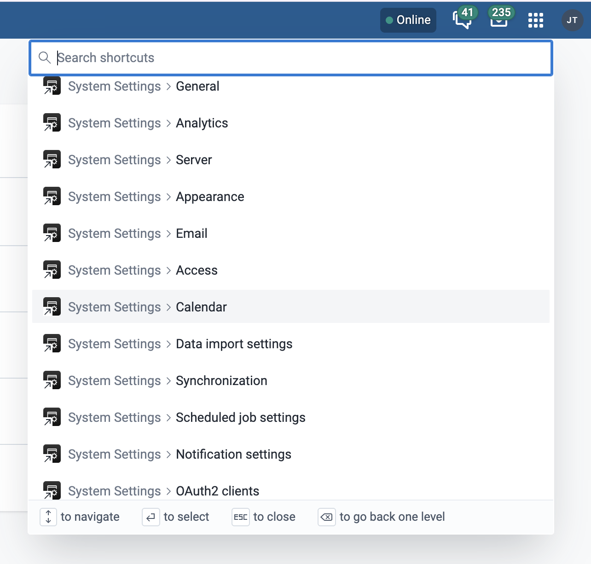

# Adding App Shortcuts To The Command Palette

You can now add shortcuts to the command palette within DHIS2.

The command palette, which extends the old app tray, is a one stop search for apps and shortcuts from anywhere within your DHIS2 instance.
With this feature, you can specify which pages users can easily access via the command palette without having to first navigate to the application itself.

_NB_: This feature is available for v42+

## Initial Step:

First things first, upgrade your application to platform v12. See the migration guide [here](../migration/v12.md).

If you already have an upgraded version of your app, then update your `@dhis2/cli-app-scripts` dependency by running:

```sh
> yarn add --dev @dhis2/cli-app-scripts
```

If this is a new/fresh DHIS2 application, then jump to the next section.

## Configuration:

In your [`d2.config.js`](<(./d2-config-js-reference.md)>), add a `shortcuts` key that takes in a list of objects pointing to specific pages in your app, with each containing two parameters.

-   `url`: this is the relative path to the app page, i.e. what comes after the `#` symbol

-   `name`: this is the shortcut name that will appear in the command palette

Below is a code snippet of what the setup can look like:

```js
/** @type {import('@dhis2/cli-app-scripts').D2Config} */
const config = {
    // ...
    shortcuts: [
        {
            url: '#/general',
            name: 'General',
        },
        {
            url: '#/analytics',
            name: 'Analytics',
        },
    ],
}
```

## Build:

Create a build of your application by running `yarn build` which makes use of the [`d2 app scripts build`](../scripts/build.md) command under the hood. You can also run `d2 app scripts build` directly instead.

This step will also generate the translations for the shortcut names included in the `d2 config file`, and update your translation files. This is a snippet of what the translations will look like:

```pot
msgctxt "Title for shortcut used by command palette"
msgid "__MANIFEST_SHORTCUT_General"
msgstr "General"

msgctxt "Title for shortcut used by command palette"
msgid "__MANIFEST_SHORTCUT_Analytics"
msgstr "Analytics"
```

## Deploy:

Deploy your application build on your DHIS2 instance. This can be done one of three ways.

-   Using the [`deploy`](../scripts/deploy.md) command.
-   Manual installation of the application via the `App Management` application.
-   Submitting your application to App Hub.

When you launch the command palette, your app shortcuts are available.

This is an example of what that looks like:

