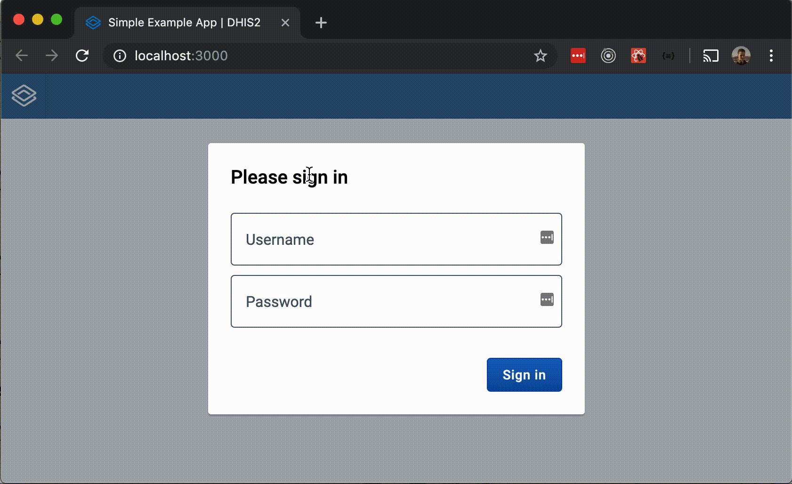

# Getting Started

For an introduction to the Application Platform concept, there is a [short article and video](https://developers.dhis2.org/2019/07/what-is-this-app-platform/) on the DHIS2 Developer Portal.

The Application Platform provides common build system, development tools, runtime support, and standard functionality for DHIS2 applications. The basic features of a modern, compliant, and functional application are all provided out-of-the-box.

The baseline features built-in to any platform application include:

-   Build and development tooling ([`@dhis2/cli-app-scripts`](scripts))
    -   I18n extract/generate
    -   Manifest generation
    -   Dependency injection
    -   Tests infrastructure
    -   Transpilation & Bundling
    -   App-shell encapsulation
    -   Publication & Release
    -   Application runtime support ([`@dhis2/app-runtime`](https://runtime.dhis2.nu))
    -   UI Components ([@dhis2/ui](https://ui.dhis2.nu))
    -   API Data fetching
    -   Translations
    -   Configuration
    -   Server discovery
    -   Loading & Error handling
    -   Authentication
